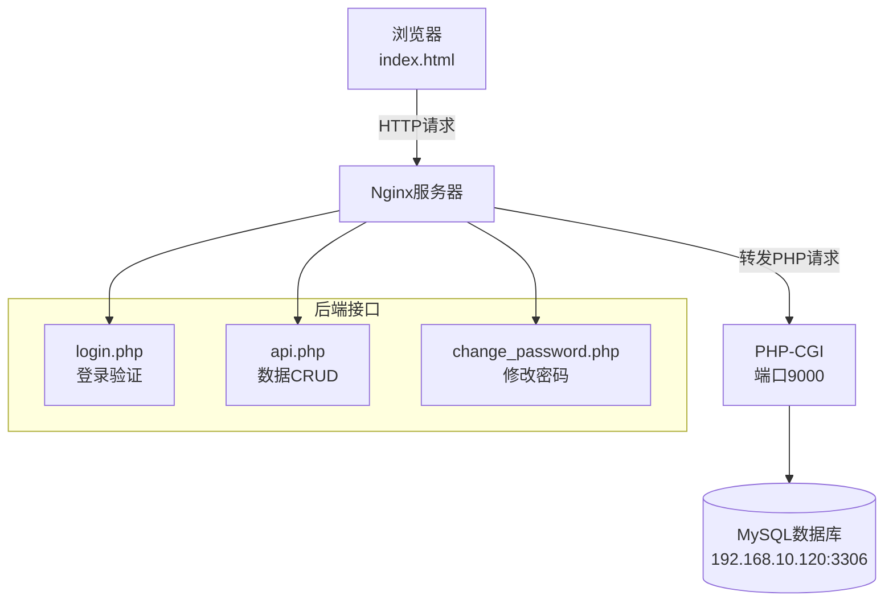

# 班级积分系统

> 一个基于 PHP + MySQL 的班级积分管理系统，用于记录学生的积分变化、管理积分规则和奖励兑换。

## 项目概述

本项目是一个班级积分管理系统，教师可以通过系统管理学生积分、设置积分规则、兑换奖励商品等功能。

### 技术栈

- **后端**: PHP (PHP-CGI, 端口 9000)
- **数据库**: MySQL 5.7+ (192.168.10.120:3306)
- **前端**: 原生 JavaScript + HTML (单页应用)
- **Web服务器**: Nginx

### 项目结构

```
test_project/
├── index.html              # 前端主页面（单页应用）
├── login.php               # 登录验证接口
├── api.php                 # 统一数据接口（学生/规则/奖励/历史）
├── change_password.php     # 修改密码接口
├── db_connect.php          # 数据库连接配置
├── init_database.sql       # 数据库初始化脚本
├── add_recitation_table.sql # 背诵记录表脚本
└── import_data.sql         # 数据导入脚本
```

## 系统架构



## 核心功能模块

### 1. 登录模块 (`login.php`)
- 支持 JSON 和表单两种提交方式
- 验证班级ID和密码
- 返回班级信息和角色

### 2. 数据接口 (`api.php`)
- `load_all`: 加载班级所有数据
- `sync_students`: 同步学生数据
- `sync_rules`: 同步积分规则
- `sync_rewards`: 同步奖励商品
- `sync_history`: 同步历史记录
- `add_history`: 添加单条历史记录
- `add_reward/delete_reward/update_reward`: 商品管理
- `sync_recitation`: 同步背诵完成数据

### 3. 密码管理 (`change_password.php`)
- 验证原密码
- 更新新密码（至少6位）

## 数据库设计

| 表名 | 说明 |
|------|------|
| `classes` | 班级账号表（登录凭证） |
| `students` | 学生信息表 |
| `point_rules` | 积分规则表 |
| `point_history` | 积分变更历史表 |
| `rewards` | 奖励兑换商品表 |
| `recitation_completed` | 背诵完成记录表 |

## 环境要求

- PHP 7.4+ (PHP-CGI模式)
- MySQL 5.7+
- Nginx 1.18+

## 当前问题

### 🔴 登录404错误

**症状**: 登录时显示 `HTTP 404 (Not Found)`

**原因**: Nginx 未正确配置 PHP-CGI 转发

**解决方案**: 需要在 nginx.conf 中添加以下配置：

```nginx
location ~ \.php$ {
    fastcgi_pass   127.0.0.1:9000;
    fastcgi_index  index.php;
    fastcgi_param  SCRIPT_FILENAME  $document_root$fastcgi_script_name;
    include        fastcgi_params;
}
```

## 开发规范

- 所有接口返回统一的 JSON 格式：`{success, message, data}`
- 使用 PDO 预处理语句防止 SQL 注入
- 错误日志记录到 PHP error_log
